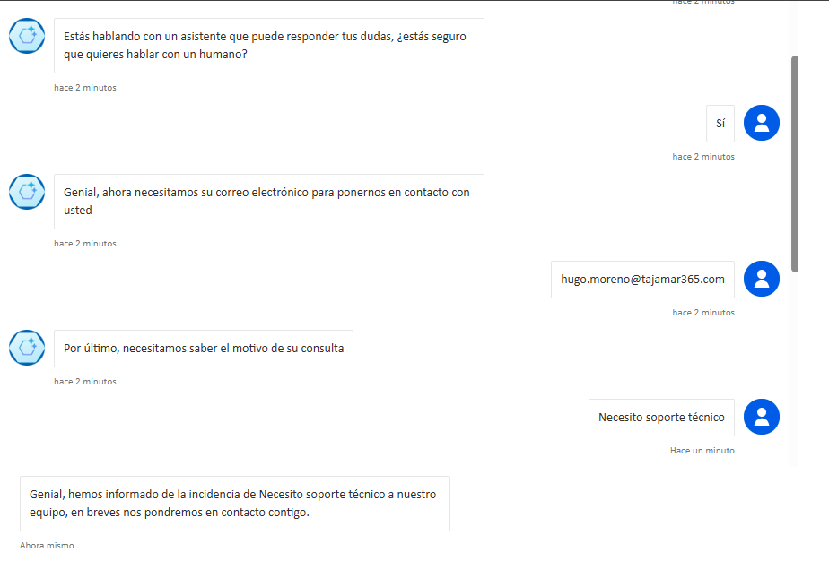
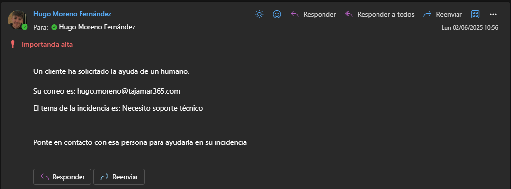
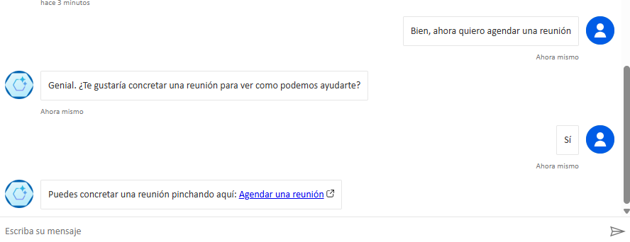
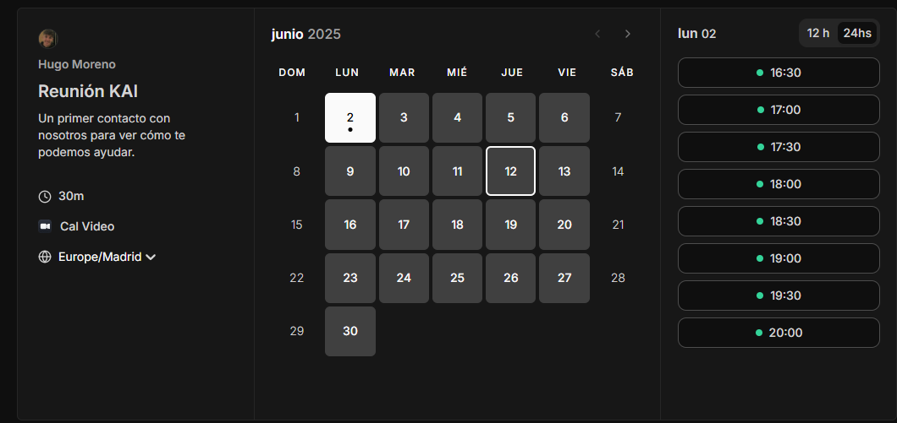
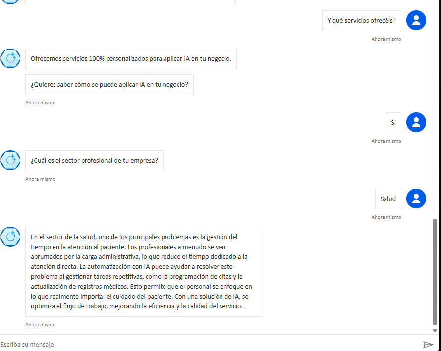
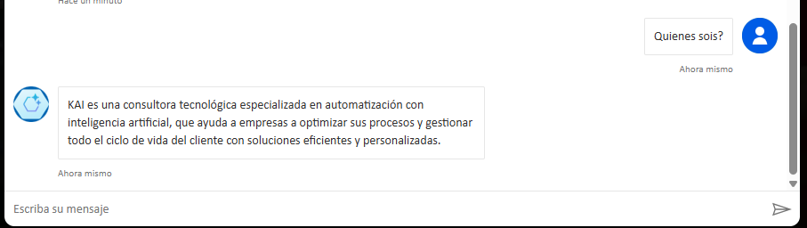
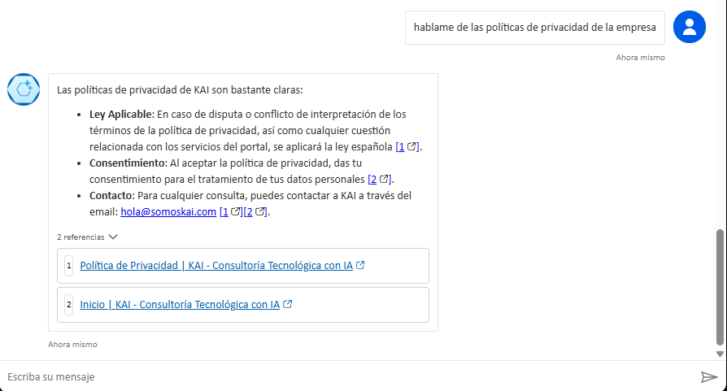

# 🤖 Chatbot KAI – Desarrollado con Copilot Studio

Este chatbot ha sido diseñado en Microsoft Copilot Studio como un asistente conversacional inteligente para automatizar interacciones clave con usuarios. A continuación, se presentan sus funcionalidades principales, acompañadas de capturas para facilitar su comprensión.

---

## 1. 📩 Remitir a un superior

Cuando el usuario solicita hablar con un humano o expresa necesidad de atención personalizada, el chatbot remite automáticamente un correo electrónico al equipo de soporte.

🖼️ **Captura del flujo de remisión a soporte:**

---

## 2. 📅 Agendar una reunión

El chatbot detecta intenciones relacionadas con la planificación de reuniones y responde con un enlace dinámico para agendar directamente con el equipo.

🖼️ **Captura del nodo de agendado:**

---

## 3. 🧠 Servicios (Casos de uso con IA)

El asistente genera automáticamente un caso de uso de aplicación de IA adaptado al sector profesional que indique el usuario. Esta funcionalidad utiliza generación dinámica de texto.

🖼️ **Captura del nodo de generación de servicios:**

---

## 4. ℹ️ ¿Qué es KAI?

Cuando se pregunta por la empresa, el chatbot responde con una frase clara y predefinida que describe la misión de KAI.

🖼️ **Captura de la respuesta sobre KAI:**

---

## 5. 📚 Knowledge Base (Base de conocimiento)

El bot puede responder preguntas relacionadas con el contenido de la web corporativa, incluyendo aspectos legales, políticas de privacidad y detalles operativos, gracias a la integración con su base de conocimiento.

🖼️ **Captura de configuración del Knowledge Base:**

---

## 🚀 Prueba el Chatbot

Puedes probar el asistente directamente en nuestra web desde este enlace:

👉 [Probar el asistente](https://tusitio.com/chatbot-kai)

---